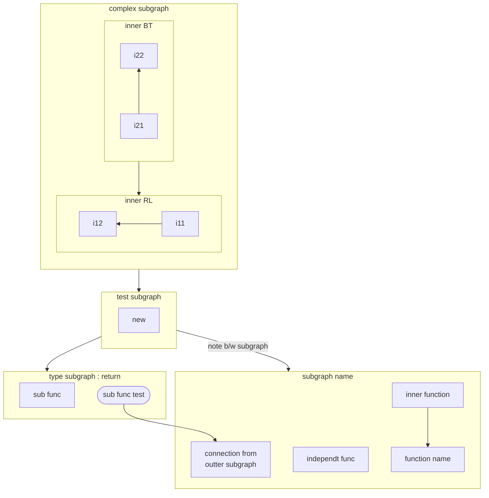

```mermaid
flowchart TB
    subgraph subg1[subgraph name]
    func_11[connection from 
            outter subgraph]
    func_12[independt func]

    func_13[inner function] --> func_14[function name]
    end

    subgraph subg2[type subgraph : return]
    func_21[sub func]
    func_22([sub func test])
    end

    func_22 --> func_11

    subgraph subg3[test subgraph]
    new
    end

    subg3 --> subg2
    subg3 -- "note b/w subgraph" --> subg1

    subgraph cs[complex subgraph]
        direction TB
        subgraph irl[inner RL]
            direction RL
            i11 --> i12
        end
        subgraph ibt[inner BT]
            direction BT
            i21 -->i22
        end
    end
    ibt --> irl
    cs --> subg3
```    